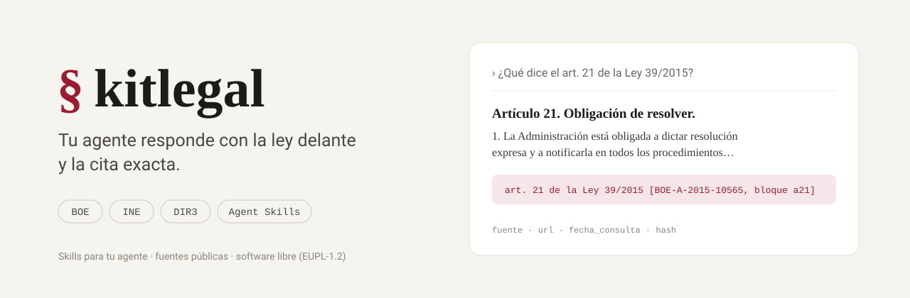

<h1 align="center">
  <picture>
    <source media="(prefers-color-scheme: dark)" srcset="docs/img/portada-oscuro.svg">
    
  </picture>
</h1>

**kitlegal enseña a tu agente a responder preguntas legales correctamente: con el texto vigente delante y la cita
exacta.**

Es un conjunto de *skills* para Claude Code, Claude Cowork, Codex, Antigravity y cualquier agente que siga el
estándar Agent Skills, más un programa, `kitlegal`, que les da lo que un modelo no debe hacer de memoria: leer el
texto vigente en el BOE, comprobar que sigue en vigor, situar un municipio y dejar cada dato con su fuente, su fecha y
su huella. Instalas kitlegal y, a partir de ahí, es **tu agente** el que consulta, razona y cita; kitlegal le da el
método y las herramientas.

La regla que lo gobierna todo: **nada sin cita**. Cada afirmación sobre una norma sale del texto que el programa acaba
de leer, y si no lo puede leer, el agente lo dice en lugar de suplirlo.

Web del proyecto: **[kitlegal.es](https://kitlegal.es)**.

## Qué sabe hacer tu agente con kitlegal

Con las dos skills que hay hoy, `boe-legislacion` y `legal-core`, tu agente responde sobre **cualquier norma
consolidada en el BOE** —leyes, reales decretos, textos refundidos, también las normas autonómicas que el BOE
consolida— y sitúa **cualquier municipio de España** en su territorio. Por ejemplo:

- «¿Qué dice el artículo 21 de la Ley 39/2015?»
- «¿Cuál es el límite de un contrato menor en la Ley de Contratos del Sector Público?»
- «¿Qué atribuciones tiene el Pleno de un ayuntamiento?»
- «¿Cuándo prescribe una deuda tributaria?»
- «¿Qué impuestos puede cobrar un ayuntamiento?»
- «¿Cuántos días de vacaciones fija el Estatuto de los Trabajadores?»
- «¿En qué plazo tiene que resolver la Administración una solicitud de acceso a información pública?»
- «¿Qué comunidad, provincia y boletines oficiales corresponden a mi ayuntamiento?»

Tu agente responde citando la norma y el artículo tal como los publica el BOE, siempre con la misma forma:

> El plazo máximo para resolver es de tres meses cuando la norma no fije otro
> —art. 21 de la Ley 39/2015 [BOE-A-2015-10565, bloque a21]—.

Y si la norma ya no está en vigor, lo dice antes que nada:

> ⚠ NORMA DEROGADA: la Ley 30/1992 fue derogada por la Ley 39/2015 …

Cuando la pregunta depende de un municipio, tu agente empieza por situarlo —provincia, comunidad autónoma, régimen
común o foral, boletines oficiales— y te dice qué parte de eso está configurada y qué no. Hoy los boletines están
configurados para la Comunidad de Madrid; para el resto de España sitúa el municipio igual y declara que su boletín
autonómico y su boletín provincial no están configurados, en lugar de inventarlos.

## Instalar

Dos órdenes. La primera instala el programa; la segunda, las skills, en el proyecto en el que estés.

**macOS y Linux**

```sh
curl -fsSL https://raw.githubusercontent.com/jmorenobl/kitlegal/main/scripts/install.sh | sh
kitlegal skills install
```

**Windows** (PowerShell, con [Scoop](https://scoop.sh))

```powershell
scoop bucket add jmorenobl https://github.com/jmorenobl/scoop-bucket
scoop install kitlegal
kitlegal skills install
```

Si ya usas Homebrew: `brew install jmorenobl/tap/kitlegal`. Cada release adjunta además paquetes `.deb` y `.rpm`, y
con Go instalado vale `go install github.com/jmorenobl/kitlegal/cmd/kitlegal@latest`.

`kitlegal skills install` deja las skills en `.agents/skills/` del directorio en el que lo ejecutes —así van con el
proyecto y las ve cualquier agente que abras ahí— y, si el proyecto tiene un `.claude/`, las enlaza también en
`.claude/skills/`, que es donde las carga Claude Code (`--host claude` lo hace aunque el `.claude/` no exista
todavía). Para tenerlas en todos tus proyectos a la vez, en lugar de en uno: `kitlegal skills install -g`. Después,
abre el agente y pregunta.

**Actualizar**: repite la primera orden (o `brew upgrade kitlegal`, o `scoop update kitlegal`) y vuelve a ejecutar
`kitlegal skills install`. Mientras lo instalado sea de una versión anterior a la del programa, el programa se lo hace
saber a tu agente en cada consulta, sin pedir nada a la red, y tu agente te lo dice.

Lo que conviene saber del instalador: no necesita nada que no traigan ya macOS y cualquier Linux (`curl`, `tar` y
`sha256sum` o `shasum`); comprueba la huella SHA-256 de lo que descarga; deja `kitlegal` en `~/.local/bin` (o en
`$KITLEGAL_INSTALL_DIR`) y, si ese directorio no está en tu `PATH`, te imprime la línea que lo añade en lugar de tocar
tus ficheros de arranque; ante cualquier fallo no instala nada a medias. `kitlegal skills install --dry-run` cuenta lo
que haría sin tocar nada, y nunca sobrescribe nada que no haya instalado él: si encuentra algo suyo con el nombre de
una skill —una carpeta tuya, un fichero editado—, lo nombra y no cambia nada. `kitlegal skills doctor` comprueba lo
instalado y, si algo no está como lo dejó, da la orden de una línea que lo arregla. Cada archivo publicado lleva su
atestación de procedencia, comprobable con `gh attestation verify <archivo> --repo jmorenobl/kitlegal`.

## Cómo funciona y qué te garantiza

- **Tu agente lee la fuente, no su memoria.** No responde con lo que «sabe» de una ley: ejecuta `kitlegal`, que
  descarga el texto vigente del BOE en ese momento y se lo devuelve con la fuente, la dirección, la fecha de consulta y
  una huella del contenido. Sobre eso razona y cita. Sin esos cuatro datos no hay cita, y sin cita no hay respuesta.
- **Comprueba la vigencia.** Antes de darte un artículo, el programa comprueba si la norma está derogada, si su
  vigencia ha terminado o si el BOE aún no ha terminado de consolidarla, y tu agente te lo traslada con un aviso de
  forma fija (`⚠ NORMA DEROGADA`, `⚠ VIGENCIA AGOTADA`, `⚠ TEXTO POSIBLEMENTE DESACTUALIZADO`).
- **Distingue.** Ley de reglamento, norma estatal de autonómica, y señala cuándo la respuesta puede variar según la
  comunidad autónoma.
- **Solo fuentes públicas, y solo lectura.** kitlegal no entra en ninguna sede electrónica, no envía nada en tu
  nombre y no necesita ninguna identidad tuya. Cuando en el futuro prepare un escrito, terminará en un fichero listo
  para que lo firmes tú.
- **Respeta las fuentes.** Se identifica ante el BOE, respeta su `robots.txt`, limita el ritmo de sus consultas y
  guarda en tu equipo lo que ya ha leído para no pedirlo dos veces.
- **Funciona con el agente y el modelo que ya uses.** kitlegal no lleva ninguna IA dentro, no envía tus preguntas a
  ningún servicio propio y no necesita ninguna cuenta: lo único que sale de tu equipo son las consultas al BOE.
- **No sustituye a un profesional.** Tu agente, con kitlegal, consulta y cita; no asesora ni tramita. Para una
  decisión con consecuencias, acude a un abogado, un asesor o el servicio de atención de tu administración.

Todo esto se mide: cada skill tiene un conjunto de preguntas de prueba que se ejecutan con el modelo real, en sesiones
de agente de verdad, antes de cada cambio que las toca; y el programa se comprueba cada noche contra el BOE real para
detectar si la fuente ha cambiado.

## ¿Y las sentencias?

Hoy kitlegal no consulta jurisprudencia, y la del Tribunal Supremo, la Audiencia Nacional, los tribunales superiores
de justicia y las audiencias provinciales no llegará por ahora, por una razón que no es técnica. Esas sentencias se
consultan en el buscador del **CENDOJ**, el Centro de Documentación Judicial del Consejo General del Poder Judicial, y
sus condiciones de uso **prohíben expresamente consultarlo de forma masiva o automatizada**; además, lo protege un
CAPTCHA. Un programa que lo recorriera, aunque fuera despacio, incumpliría esas condiciones y esquivaría una barrera
puesta a propósito. kitlegal solo usa fuentes que permiten lo que hace con ellas, así que no lo hace.

Lo que sí está previsto, por vías que lo permiten:

- **Las sentencias del Tribunal Constitucional**, que se publican todas en el BOE, y las del Supremo que anulan una
  disposición, que también se publican en él: tu agente podrá leerlas y citarlas con su ECLI igual que hoy cita un
  artículo.
- **Reconocer y citar bien una sentencia que tú identifiques** (por su ECLI o su ROJ) y decirte dónde consultarla,
  sin resumir nunca un texto que el programa no ha leído.

Mientras tanto, si necesitas una sentencia del Supremo o de otro tribunal, búscala en el CENDOJ o en una base de datos
jurídica y pégasela a tu agente: con el texto delante, la analizará y la citará con el mismo rigor. Si el Consejo
General del Poder Judicial abre una vía pública para programas o cambia sus condiciones, se revisará. La decisión, en
[docs/ADR/0003-no-cendoj-masivo.md](docs/ADR/0003-no-cendoj-masivo.md).

## Lo que viene

kitlegal se construye por hitos, en el orden en que cada cosa empieza a ser útil. Sin fechas: cada hito se publica
cuando funciona y está medido. Lo que hay hoy es la base sobre la que se apoya todo lo demás.

**Pronto: citas verificadas, plazos y memoria.** Que tu agente resuelva una cita en lenguaje natural («el artículo de
la LPAC sobre el silencio administrativo») al texto vigente con su dirección oficial; que calcule plazos
administrativos con los festivos nacionales, autonómicos y locales de tu municipio; y que `kitlegal` recuerde qué
normas ha consultado para avisar si alguna ha cambiado desde entonces.

**Después: actuar ante la Administración.** Seguir tus expedientes (qué pediste, a quién, cuándo, qué plazo corre) y
preparar escritos fundamentados —una solicitud de acceso a información pública, un recurso de reposición, unas
alegaciones— que terminan en un fichero listo para firmar. Valen ante cualquier administración, porque el
procedimiento común es el mismo para un ministerio, una consejería, una diputación o un ayuntamiento.

**Luego: saber qué hacen las administraciones.** Qué contrata cada una y a quién (la Plataforma de Contratación del
Sector Público recoge al Estado, las comunidades, las diputaciones y los ayuntamientos), qué subvenciona (la Base de
Datos Nacional de Subvenciones, también de todas), qué publica sobre ti en el BOE, en el boletín de tu comunidad o de
tu provincia y en el tablón edictal, qué dicen las ordenanzas de tu municipio, qué sociedades y administradores
aparecen en el BORME, y cómo van los presupuestos de tu ayuntamiento.

**Especializaciones por materia**, sobre la misma base y con el mismo rigor: **fiscal** (IRPF, IVA, Sociedades, LGT,
obligaciones de autónomos y empresas; es la primera, porque ya existe como skill aparte), **laboral** (Estatuto de los
Trabajadores, convenios, Seguridad Social), **mercantil** (sociedades, Registro Mercantil, BORME), y las que el uso
pida.

**Más fuentes y más territorio**: jurisprudencia del Tribunal Constitucional por su ECLI, EUR-Lex, el Congreso, el
Catastro, los datos abiertos de las administraciones; y los boletines de cada comunidad autónoma y provincia, el
régimen foral y las haciendas forales, conforme se configuren. Añadir un territorio es añadir datos, no cambiar las
skills.

**Y otras formas de usarlo**: un servidor MCP para cualquier agente que hable ese protocolo, un plugin para Claude
Code, paquetes por especialidad y una librería Go para quien quiera construir encima.

### Para quién

- **Ciudadanía**: qué dice la ley que te afecta, qué plazo tienes, qué puedes pedir a cualquier administración y cómo.
- **Profesionales** —abogados, asesorías fiscales, gestorías, administradores de fincas—: citas exactas y vigentes en
  segundos, con la huella que permite volver a comprobarlas.
- **Autónomos y pymes**: obligaciones fiscales, laborales y mercantiles, con la norma delante.
- **Cargos electos y periodistas**: qué hace cada administración, con fuente.
- **Las propias administraciones**: la misma herramienta con la que se les pregunta, para responder con la norma en
  la mano.

## Para desarrolladores

Todo lo técnico —cómo se construye desde el clon, cómo se prueban las skills, cómo se añade una fuente o un
territorio, cómo se publica una release y el workflow autónomo con el que se implementa cada hito— está en
[CONTRIBUTING.md](CONTRIBUTING.md). Lo que cambia en cada versión, en [CHANGELOG.md](CHANGELOG.md); el plan
completo, en [docs/ROADMAP.md](docs/ROADMAP.md); las decisiones, en [docs/ADR/](docs/ADR/).

## Licencia

kitlegal es software libre bajo la [Licencia Pública de la Unión Europea (EUPL) v. 1.2](LICENSE). Puedes usarlo,
estudiarlo, modificarlo y distribuirlo; si distribuyes una versión modificada, o la ofreces como servicio, tiene que
seguir siendo libre bajo la EUPL o una licencia compatible. La versión en castellano, con el mismo valor jurídico que
la inglesa de `LICENSE`, es la publicada en el Diario Oficial de la UE por la
[Decisión de Ejecución (UE) 2017/863](https://eur-lex.europa.eu/eli/dec_impl/2017/863/oj?locale=es).
